
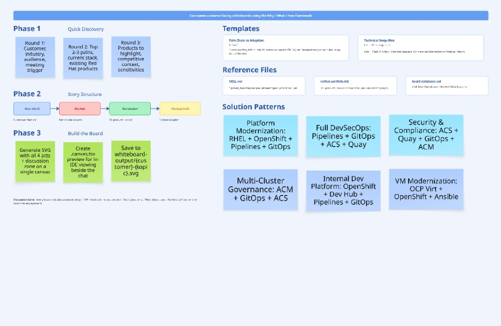
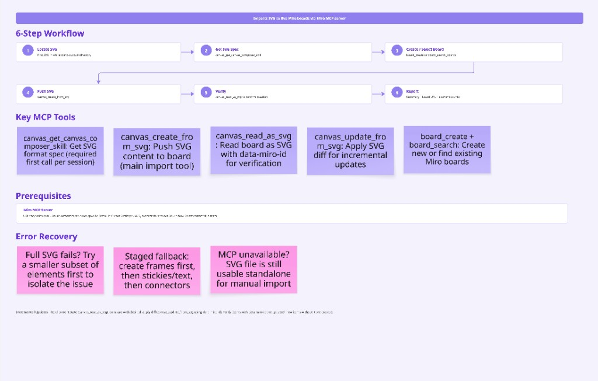

# Whiteboarding Skills

Cursor Agent Skills for co-creating customer-facing whiteboards as a **Red Hat Adoption Architect**. Map customer pain chains to Red Hat products, generate story-flow boards, and push them directly to Miro — all from within Cursor.

## Overview

This repository contains two complementary skills that form an end-to-end whiteboarding workflow:

| Skill | Purpose |
|-------|---------|
| **[Whiteboarding Champion](whiteboarding-champion/SKILL.md)** | Co-creates whiteboards using the Why / What / How framework. Guides discovery, maps pains to Red Hat products, and generates SVG output. |
| **[Miro Import](miro-import/SKILL.md)** | Takes the SVG output (or any compatible SVG) and pushes it to a Miro board via the official Miro MCP server. Handles board creation, upload, verification, and incremental updates. |

## Workflow



### The 4-Act Story Flow

Every board follows a left-to-right narrative:

1. **Their World** — Current-state architecture diagram mirroring the customer's environment
2. **The Pain** — Red/pink sticky notes pinned *on* the architecture, connected in cause-and-effect chains
3. **The Solution** — Red Hat product architecture with direct arrows from each pain to the product that solves it
4. **The Easy Path** — 3-phase adoption timeline (Pilot → Expand → Scale) with a Before/After comparison

Plus a **Discussion Zone** at the bottom for live customer engagement.

## Getting Started

### Prerequisites

- [Cursor](https://cursor.com) with Agent mode enabled
- A Miro account (free or paid) — only needed when you want to push boards to Miro

### Step 1: Clone the repo

```bash
git clone git@github.com:poothia/whiteboarding-skills.git
```

### Step 2: Install the skills into Cursor

Copy both skill folders into Cursor's skills directory:

```bash
mkdir -p ~/.cursor/skills
cp -r whiteboarding-skills/whiteboarding-champion ~/.cursor/skills/
cp -r whiteboarding-skills/miro-import ~/.cursor/skills/
```

### Step 3: Verify it works

Restart Cursor (or run **Developer: Reload Window** from the command palette), then open a new Agent chat and type:

> *"Create a whiteboard for Acme Corp — they have config drift and failing audits"*

If the agent starts asking discovery questions about the customer, the skills are loaded and working.

## Miro Connection

**You don't need to set anything up manually.** The Miro Import skill automatically detects whether the Miro MCP server is connected. If it isn't, the skill will walk you through the setup right inside the chat — just follow the prompts.

To trigger it, simply ask:

> *"Push this whiteboard to Miro"*

The agent will handle the rest: installing the Miro MCP plugin, opening the OAuth login, and verifying the connection.

### Manual Setup (if auto-setup fails)

If the automatic setup doesn't work, you can configure the Miro MCP by hand:

1. Open **Cursor Settings** (`Cmd+,` on Mac / `Ctrl+,` on Windows/Linux) → **MCP**
2. Search for **Miro** in the marketplace and click **Install**
3. If the marketplace search doesn't find it, click **Add MCP Server** and paste this config:
   ```json
   {
     "mcpServers": {
       "miro-mcp": {
         "url": "https://mcp.miro.com/",
         "disabled": false,
         "autoApprove": []
       }
     }
   }
   ```
4. Click **Connect** — a browser window opens with Miro's OAuth flow
5. Log in to Miro and **select the team** where you want boards created (MCP is team-specific)
6. Click **Allow** — you'll see "Authentication successful" and get redirected back to Cursor
7. Verify by asking the agent: *"Search my Miro boards"* — if it returns results, you're good to go

## Usage

### Create a Whiteboard

Prompt the agent in Cursor:

> *"Create a whiteboard for Acme Bank — they're struggling with config drift and failing SOX audits"*

The **Whiteboarding Champion** skill will:
1. Run a quick 2–3 round discovery (customer context, pains, current stack)
2. Map pains to Red Hat products using the built-in [portfolio reference](whiteboarding-champion/redhat-portfolio.md)
3. Present a 4-act story structure for approval
4. Generate an SVG file in `whiteboard-output/` and a `.canvas.tsx` preview



### Push to Miro

Once the SVG is ready:

> *"Push this whiteboard to Miro"*

The **Miro Import** skill will:
1. Locate the SVG in `whiteboard-output/`
2. Fetch the Miro SVG spec via `canvas_get_canvas_composer_skill`
3. Create a new board (or add to an existing one)
4. Upload the SVG and verify all elements were created
5. Return the board URL



### Update an Existing Board

> *"Add a proof point to the ACS section on the Acme Bank board"*

The Miro Import skill supports incremental updates — it reads the current board state, computes a diff, and applies only the changes.

## Repository Structure

```
whiteboarding-skills/
├── README.md
├── docs/
│   └── images/
│       ├── end-to-end-pipeline.jpg
│       ├── miro-import.jpg
│       └── whiteboarding-champion.jpg
├── whiteboarding-champion/
│   ├── SKILL.md              # Main skill definition & agent instructions
│   ├── redhat-portfolio.md   # Product catalog, pain-to-product map, solution patterns
│   └── board-templates.md    # Two complete board layout examples
└── miro-import/
    ├── SKILL.md              # Import skill definition & workflow
    └── reference.md          # Miro MCP tool reference & troubleshooting
```

## Red Hat Product Coverage

The skills include a comprehensive [pain-to-product map](whiteboarding-champion/redhat-portfolio.md) covering:

- **OpenShift Container Platform** — Enterprise Kubernetes foundation
- **Ansible Automation Platform** — Infrastructure & ops automation
- **Advanced Cluster Security (ACS)** — Kubernetes-native security
- **Advanced Cluster Management (ACM)** — Multi-cluster governance
- **Quay** — Private container registry with scanning
- **OpenShift GitOps (ArgoCD)** — Declarative continuous delivery
- **OpenShift Pipelines (Tekton)** — Cloud-native CI/CD
- **RHEL** — Enterprise Linux foundation
- **OpenShift Virtualization, Serverless, Service Mesh, Data Foundation**, and more

### Pre-Built Solution Patterns

| Pattern | Products |
|---------|----------|
| Platform Modernization | RHEL + OpenShift + Pipelines + GitOps |
| Full DevSecOps | Pipelines + GitOps + ACS + Quay |
| Security & Compliance | ACS + Quay + GitOps + ACM |
| Multi-Cluster Governance | ACM + GitOps + ACS |
| Hybrid / Disconnected | OpenShift + Quay Mirror + ACM + Ansible |
| Internal Developer Platform | OpenShift + Developer Hub + Pipelines + GitOps |
| VM Modernization | OpenShift Virtualization + OpenShift + Ansible |

## Board Templates

Two ready-to-use templates are included in [board-templates.md](whiteboarding-champion/board-templates.md):

1. **Pain Chain to Adoption** (default) — Classic 4-act linear flow, ideal for executive and mixed audiences
2. **Technical Deep-Dive** — Side-by-side before/after with Mermaid sequence diagrams and concrete task lists, ideal for platform engineers and architects

## Refreshing the Portfolio

When Red Hat releases new products or renames existing ones:

> *"Refresh the portfolio"*

The agent will update `redhat-portfolio.md` with current product information, add new entries to the pain-to-product map, and timestamp the refresh.

## Troubleshooting

| Issue | Fix |
|-------|-----|
| Miro tools not available | Install & connect the Miro MCP plugin in Cursor Settings → MCP |
| "Unauthorized" errors | Disconnect and reconnect the Miro MCP; verify you selected the correct team |
| SVG creation fails | Ensure `canvas_get_canvas_composer_skill` is called first; check SVG against the spec |
| Board not found | MCP is team-specific — re-authenticate with the team that owns the board |
| Rate limiting (429) | Batch content into fewer SVG payloads; check [Miro MCP usage limits](https://developers.miro.com/docs/mcp-usage-and-daily-limits) |